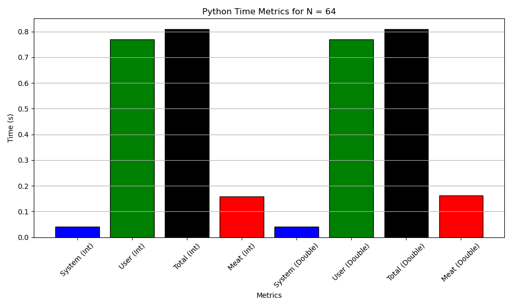

# Report - Question 2:
---

## Problem Statement:
Write a simple Matrix Multiplication program for a given NxN matrix in any two of your preferred Languages from the following listed buckets, where N is iterated through the set of values 64, 128, 256, 512 and 1024. N can either be hardcoded or specified as input. Consider two cases (a) Elements of matrix are of data type Integer and (b) Double In each case, (i.e. Bucket 1 for (a) and (b) + Bucket 2 for (a) and( b)) (Total: 100 points)

- Bucket1: C, C++, Go 
- Bucket2: Python, Java.

a. Report the output of the ‘time’ describing the system and CPU times. (25 points) 

b. Using the ‘language hooks’ evaluate the execution time for the meat portions of the program and how much proportion is it w.r.t. total program execution time. (25 points)

c. Plot the (a) and (b) execution times for each of the iterations. And compare the performance (System and Program execution times) of the program for given value of N for the languages in both the buckets. –Illustrate your observations. (50 points)

## Assumptions:
- In Python, the double data type does not exist explicitly; instead, the float data type is used.
- For simplicity, the time measurements are calculated based on five separate runs, with the median value used for analysis. The mean is also calculated and could also be used in place for median; hovever it is avoided in current report.
- The time measurements are calculated by using the time module in python and the timespec module in C++. The intrinsic difference in the implementation of the functionalities are not taken in account here.
- To maintain consistency in comparision, the values are initilized by ones (1 for int and 1.0 for double/float) in all matrixes.

## Part A:

### Overview and Terminoogy:

I have used the ```time``` command for linux based terminal that times the given program and returns the following matics:

- For C++ programs:
```  linux
g++ program_file.cpp
time ./a.out
```

- For python programs:
``` linux
time python program_file.py
```

- Output format for time command:
    - **Real Time:** The actual elapsed time, from start to finish, including time spent waiting for I/O and other processes.
    - **User Time:** The amount of CPU time spent executing user-mode instructions within the process.
    - **System Time:** The amount of CPU time spent executing system-level instructions on behalf of the process.

### C++ Int:
Refer to [Mat_Mul_Int.cpp](https://github.com/aditya-me13/ES215-IITGN/blob/main/Assignment1/Question2/Mat_Mul_Int.cpp) for the code. The time taken to execute the program for 5 different times are as follows:

> User CPU Time

All units in seconds unless stated otherwise

| N    | Reading 1 | Reading 2 | Reading 3 | Reading 4 | Reading 5 | **Mean** | **Median** |
| ---- | --------- | --------- | --------- | --------- | --------- | -------- | ---------- |
| 64   | 0.01      | 0.01      | 0.01      | 0.01      | 0.01      | 0.01     | 0.01       |
| 128  | 0.01      | 0.02      | 0.02      | 0.02      | 0.02      | 0.02     | 0.02       |
| 256  | 0.13      | 0.14      | 0.13      | 0.11      | 0.12      | 0.13     | 0.13       |
| 512  | 0.80      | 0.76      | 0.81      | 0.78      | 0.81      | 0.79     | 0.80       |
| 1024 | 5.97      | 6.00      | 6.17      | 6.09      | 6.12      | 6.07     | 6.09       |     

> System Time

All units in seconds unless stated otherwise

|          N     | Reading 1 | Reading 2 | Reading 3 | Reading 4 | Reading 5 | **Mean** | **Median** |
| -------------- | --------- | --------- | --------- | --------- | --------- | -------- | ---------- |
| 64   | 0.00    | 0.00      | 0.00      | 0.00      | 0.00      | 0.00    | 0.00       |
| 128  | 0.00    | 0.00      | 0.00      | 0.00      | 0.00      | 0.00    | 0.00       |
| 256  | 0.00    | 0.00      | 0.00      | 0.00      | 0.00      | 0.00    | 0.00       |
| 512  | 0.00    | 0.00      | 0.00      | 0.00      | 0.00      | 0.00    | 0.00       |
| 1024 | 0.01    | 0.01      | 0.02      | 0.01      | 0.02      | 0.015   | 0.01       |

> Real Time 

All units in seconds unless stated otherwise

|          N     | Reading 1 | Reading 2 | Reading 3 | Reading 4 | Reading 5 | **Mean** | **Median** |
| -------------- | --------- | --------- | --------- | --------- | --------- | -------- | ---------- |
| 64   | 0.01      | 0.01      | 0.01      | 0.01      | 0.01      | 0.01     | 0.01       |
| 128  | 0.01      | 0.02      | 0.02      | 0.02      | 0.02      | 0.01     | 0.02       |
| 256  | 0.13      | 0.14      | 0.13      | 0.11      | 0.12      | 0.13     | 0.13       |
| 512  | 0.80      | 0.76      | 0.81      | 0.78      | 0.81      | 0.79     | 0.80       |
| 1024 | 5.98      | 6.01      | 6.19      | 6.10      | 6.14      | 6.08     | 6.10       |


### C++ Double:
Refer to [Mat_Mul_Double.cpp](https://github.com/aditya-me13/ES215-IITGN/blob/main/Assignment1/Question2/Mat_Mul_Double.cpp) for the code. The time taken to execute the program for 5 different times are as follows:

> User CPU Time

All units in seconds unless stated otherwise

| N    | Reading 1 | Reading 2 | Reading 3 | Reading 4 | Reading 5 | **Mean** | **Median** |
| ---- | --------- | --------- | --------- | --------- | --------- | -------- | ---------- |
| 64   | 0.01      | 0.01      | 0.01      | 0.01      | 0.01      | 0.01     | 0.01       |
| 128  | 0.04      | 0.03      | 0.03      | 0.03      | 0.03      | 0.032    | 0.03       |
| 256  | 0.13      | 0.13      | 0.14      | 0.13      | 0.12      | 0.13     | 0.13       |
| 512  | 0.80      | 0.79      | 0.81      | 0.79      | 0.80      | 0.79     | 0.80       |
| 1024 | 6.97      | 7.37      | 6.94      | 6.96      | 7.05      | 6.948    | 6.97       |

> System Time

All units in seconds unless stated otherwise

|          N     | Reading 1 | Reading 2 | Reading 3 | Reading 4 | Reading 5 | **Mean** | **Median** |
| -------------- | --------- | --------- | --------- | --------- | --------- | -------- | ---------- |
| 64   | 0.00    | 0.00      | 0.00      | 0.00      | 0.00      | 0.00    | 0.00       |
| 128  | 0.00    | 0.00      | 0.00      | 0.00      | 0.00      | 0.00    | 0.00       |
| 256  | 0.00    | 0.00      | 0.00      | 0.00      | 0.00      | 0.00    | 0.00       |
| 512  | 0.00    | 0.00      | 0.00      | 0.00      | 0.00      | 0.00    | 0.00       |
| 1024 | 0.01    | 0.01      | 0.01      | 0.02      | 0.02      | 0.015   | 0.01       |

> Real Time

All units in seconds unless stated otherwise

|          N     | Reading 1 | Reading 2 | Reading 3 | Reading 4 | Reading 5 | **Mean** | **Median** |
| -------------- | --------- | --------- | --------- | --------- | --------- | -------- | ---------- |
| 64   | 0.01      | 0.01      | 0.01      | 0.01      | 0.01      | 0.01     | 0.01       |
| 128  | 0.04      | 0.03      | 0.03      | 0.03      | 0.03      | 0.032    | 0.03       |
| 256  | 0.13      | 0.13      | 0.14      | 0.13      | 0.12      | 0.13     | 0.13       |
| 512  | 0.80      | 0.79      | 0.81      | 0.79      | 0.80      | 0.79     | 0.80       |
| 1024 | 6.98      | 7.38      | 6.95      | 6.98      | 7.07      | 6.952    | 6.98       |

### python Int:
Refer to [Mat_Mul_Int.py](https://github.com/aditya-me13/ES215-IITGN/blob/main/Assignment1/Question2/Mat_Mul_Int.py) for the code. The time taken to execute the program for 5 different times are as follows:

> User CPU Time

All units in seconds unless stated otherwise

| N    | Reading 1 | Reading 2 | Reading 3 | Reading 4 | Reading 5 | **Mean** | **Median** |
| ---- | --------- | --------- | --------- | --------- | --------- | -------- | ---------- |
| 64   | 0.77      | 0.76      | 0.76      | 0.78      | 0.77      | 0.76     | 0.77       |
| 128  | 1.89      | 1.87      | 2.00      | 1.89      | 1.88      | 1.886    | 1.89       |
| 256  | 10.77     | 11.35     | 10.99     | 10.97     | 10.87     | 10.914   | 10.97      |
| 512  | 84.17     | 86.18     | 82.22     | 83.13     | 81.77     | 83.102   | 83.13      |
| 1024 | 833.42    | 860.73    | 857.13    | 843.72    | 857.21    | 850.642  | 857.13     |
  

> System Time

All units in seconds unless stated otherwise

| N    | Reading 1 | Reading 2 | Reading 3 | Reading 4 | Reading 5 | **Mean** | **Median** |
| ---- | --------- | --------- | --------- | --------- | --------- | -------- | ---------- |
| 64   | 0.04      | 0.03      | 0.04      | 0.03      | 0.04      | 0.036    | 0.04       |
| 128  | 0.09      | 0.04      | 0.04      | 0.05      | 0.04      | 0.052    | 0.04       |
| 256  | 0.07      | 0.05      | 0.05      | 0.07      | 0.06      | 0.060    | 0.06       |
| 512  | 0.23      | 0.21      | 0.21      | 0.24      | 0.22      | 0.222    | 0.22       |
| 1024 | 2.37      | 2.44      | 2.41      | 2.39      | 2.37      | 2.396    | 2.39       |      

> Real Time

All units in seconds unless stated otherwise

| N    | Reading 1 | Reading 2 | Reading 3 | Reading 4 | Reading 5 | **Mean** | **Median** |
| ---- | --------- | --------- | --------- | --------- | --------- | -------- | ---------- |
| 64   | 0.81      | 0.79      | 0.80      | 0.81      | 0.81      | 0.80     | 0.81       |
| 128  | 1.98      | 1.91      | 2.04      | 1.94      | 1.92      | 1.96     | 1.94       |
| 256  | 10.84     | 11.40     | 11.04     | 11.04     | 10.93     | 10.93    | 10.97      |
| 512  | 84.40     | 86.39     | 82.43     | 83.37     | 81.99     | 83.12    | 83.37      |
| 1024 | 835.79    | 863.17    | 859.94    | 846.11    | 859.48    | 852.64   | 859.94     |

### python Double:
Refer to [Mat_Mul_Double.py](https://github.com/aditya-me13/ES215-IITGN/blob/main/Assignment1/Question2/Mat_Mul_Double.py) for the code. The time taken to execute the program for 5 different times are as follows:

> User CPU Time

All units in seconds unless stated otherwise

| N    | Reading 1 | Reading 2 | Reading 3 | Reading 4 | Reading 5 | **Mean** | **Median** |
| ---- | --------- | --------- | --------- | --------- | --------- | -------- | ---------- |
| 64   | 0.78      | 0.77      | 0.77      | 0.78      | 0.78      | 0.776    | 0.77       |
| 128  | 1.84      | 1.86      | 1.85      | 1.90      | 1.88      | 1.864    | 1.86       |
| 256  | 10.98     | 11.24     | 11.27     | 10.86     | 10.70     | 11.03    | 10.98      |
| 512  | 85.21     | 86.17     | 84.98     | 85.31     | 82.55     | 84.844   | 85.21      |
| 1024 | 837.56    | 843.41    | 847.72    | 844.77    | 854.38    | 845.568  | 844.77     |

> System Time

All units in seconds unless stated otherwise

| N    | Reading 1 | Reading 2 | Reading 3 | Reading 4 | Reading 5 | **Mean** | **Median** |
| ---- | --------- | --------- | --------- | --------- | --------- | -------- | ---------- |
| 64   | 0.04      | 0.04      | 0.04      | 0.04      | 0.04      | 0.04     | 0.04       |
| 128  | 0.06      | 0.04      | 0.05      | 0.04      | 0.04      | 0.046    | 0.04       |
| 256  | 0.09      | 0.05      | 0.04      | 0.05      | 0.06      | 0.058    | 0.05       |
| 512  | 0.24      | 0.21      | 0.23      | 0.24      | 0.24      | 0.232    | 0.24       |
| 1024 | 4.04      | 4.12      | 4.09      | 4.19      | 4.16      | 4.12     | 4.12       |

> Real Time

All units in seconds unless stated otherwise

| N    | Reading 1 | Reading 2 | Reading 3 | Reading 4 | Reading 5 | **Mean** | **Median** |
| ---- | --------- | --------- | --------- | --------- | --------- | -------- | ---------- |
| 64   | 0.82      | 0.81      | 0.81      | 0.82      | 0.82      | 0.814    | 0.81       |
| 128  | 1.90      | 1.90      | 1.90      | 1.94      | 1.92      | 1.914    | 1.90       |
| 256  | 11.07     | 11.29     | 11.31     | 10.91     | 10.76     | 11.045   | 11.07      |
| 512  | 85.45     | 86.38     | 85.21     | 85.55     | 82.79     | 85.076   | 85.21      |
| 1024 | 841.60    | 847.53    | 851.81    | 848.96    | 858.54    | 849.688  | 848.96     |


## Part B:

### Overview and Terminoogy:

I have used ```ctime``` and ```time``` for meat portion timing in c++ and python respectively
- C++ Programs:
``` c++
#include <ctime>
clock_t start = clock();
// Meat Portion of Algorithm here
clock_t end = clock();
double time_taken = (double)(end - start) / CLOCKS_PER_SEC;
```

- Python Programs:
``` python
import time
start = time.time()
# Meat Portion of Algorithm here
end = time.time()
time_taken = end - start
```

### C++ Int:

Refer to [Mat_Mul_Int.cpp](https://github.com/aditya-me13/ES215-IITGN/blob/main/Assignment1/Question2/Mat_Mul_Int.cpp) for the code. The time taken to execute the meat part of the program for 5 different times are as follows:

All units in seconds unless stated otherwise

| N    | Reading 1 | Reading 2 | Reading 3 | Reading 4 | Reading 5 | **Mean** | **Median** |
| ---- | --------- | --------- | --------- | --------- | --------- | -------- | ---------- |
| 64   | 0.00444   | 0.004382  | 0.004403  | 0.003772  | 0.004347  | 0.004369 | 0.004382   |
| 128  | 0.021139  | 0.018888  | 0.018356  | 0.018547  | 0.01843   | 0.019072 | 0.018547   |
| 256  | 0.123017  | 0.131908  | 0.12096   | 0.10603   | 0.115548  | 0.119092 | 0.12096    |
| 512  | 0.790192  | 0.749669  | 0.799724  | 0.764032  | 0.791435  | 0.780810 | 0.764032   |
| 1024 | 5.93826   | 5.95407   | 6.13304   | 6.06976   | 6.1205    | 6.043527 | 6.06976    |

### C++ Double:

Refer to [Mat_Mul_Double.cpp](https://github.com/aditya-me13/ES215-IITGN/blob/main/Assignment1/Question2/Mat_Mul_Double.cpp) for the code. The time taken to execute the meat part of the program for 5 different times are as follows:

All units in seconds unless stated otherwise

| N    | Reading 1 | Reading 2 | Reading 3 | Reading 4 | Reading 5 | **Mean** | **Median** |
| ---- | --------- | --------- | --------- | --------- | --------- | -------- | ---------- |
| 64   | 0.003428  | 0.004774  | 0.004868  | 0.004846  | 0.004735  | 0.004530 | 0.004735   |
| 128  | 0.032149  | 0.029168  | 0.028989  | 0.029876  | 0.029449  | 0.029526 | 0.029449   |
| 256  | 0.124861  | 0.123424  | 0.130697  | 0.125460  | 0.126984  | 0.126085 | 0.125460   |
| 512  | 0.774725  | 0.775412  | 0.780690  | 0.786044  | 0.788563  | 0.782687 | 0.780690   |
| 1024 | 6.931850  | 7.327190  | 6.904250  | 6.924790  | 7.015360  | 6.920100 | 6.924790   |


### python Int:

Refer to [Mat_Mul_Int.py](https://github.com/aditya-me13/ES215-IITGN/blob/main/Assignment1/Question2/Mat_Mul_Int.py) for the code. The time taken to execute the meat part of the program for 5 different times are as follows:

All units in seconds unless stated otherwise

| N    | Reading 1  | Reading 2  | Reading 3  | Reading 4 | Reading 5   | **Mean**   | **Median** |
| ---- | ---------- | ---------- | ---------- | --------- | ----------- | ---------- | ---------- |
| 64   | 0.158992   | 0.162897   | 0.153050   | 0.159421  | 0.155507    | 0.157573   | 0.158992   |
| 128  | 1.254689   | 1.269708   | 1.250581   | 1.258701  | 1.253033    | 1.257742   | 1.258701   |
| 256  | 10.214075  | 10.239041  | 10.219732  | 10.222125 | 10.219405   | 10.222075  | 10.219732  |
| 512  | 82.413304  | 82.434273  | 82.434273  | 82.434273 | 82.434273   | 82.430119  | 82.434273  |
| 1024 | 860.008860 | 846.086657 | 859.870626 | 863.368388 | 835.638239 | 832.814554 | 859.870626 |

### python Double 

Refer to [Mat_Mul_Double.py](https://github.com/aditya-me13/ES215-IITGN/blob/main/Assignment1/Question2/Mat_Mul_Double.py) for the code. The time taken to execute the meat part of the program for 5 different times are as follows:

All units in seconds unless stated otherwise

| N    | Reading 1 | Reading 2 | Reading 3 | Reading 4 | Reading 5 | **Mean**  | **Median** |
| ---- | --------- | --------- | --------- | --------- | --------- | --------- | ---------- |
| 64   | 0.162712  | 0.162897  | 0.164405  | 0.159453  | 0.155507  | 0.160994  | 0.162897   |
| 128  | 1.321193  | 1.329323  | 1.342157  | 1.421130  | 1.391193  | 1.362199  | 1.342157   |
| 256  | 10.616071 | 10.689795 | 10.703395 | 10.287527 | 10.190643 | 10.497686 | 10.616071  |
| 512  | 84.046852 | 83.035385 | 84.352355 | 83.132847 | 85.009324 | 83.915772 | 84.046852  |
| 1024 | 841.826392 | 858.567721 | 852.969217 | 859.986650 | 859.385779 | 854.547752 | 858.567721 |

### Fraction of Meat portion:

| N                    | 64       | 128      | 256      | 512      | 1024     |
| -------------------- | -------- | -------- | -------- | -------- | -------- |
| C++ Int Total        | 0.01     | 0.02     | 0.13     | 0.80     | 6.10     |
| C++ Int Meat         | 0.004382 | 0.018547 | 0.12096  | 0.764032 | 6.06976  |
| C++ Int Fraction     | 0.4382   | 0.92735  | 0.930457 | 0.955040 | 0.994977 |
| | | | | | |
| C++ Double Total     | 0.01     | 0.03     | 0.13     | 0.80     | 6.98     |
| C++ Double Meat      | 0.004735 | 0.029449 | 0.125460 | 0.780690 | 6.924790 |
| C++ Double Fraction  | 0.4735   | 0.981637 | 0.965073 | 0.975862 | 0.992131 |
| | | | | | |
| Python Int Total     | 0.81     | 1.94     | 10.97    | 83.37    | 859.94   |
| Python Int Meat      | 0.158992 | 1.258701 | 10.219732| 82.434273| 859.870626 |
| Python Int Fraction  | 0.196277 | 0.648645 | 0.931474 | 0.988767 | 0.999918 |
| | | | | | |
| Python Double Total  | 0.81     | 1.90     | 11.07    | 85.21    | 868.96   |
| Python Double Meat   | 0.162897 | 1.342157 | 10.616071| 84.046852| 858.567721 |
| Python Double Fraction| 0.201110| 0.706398 | 0.959040 | 0.986327 | 0.988055 |


## Part C:

### Overview

This report compares the performance of matrix multiplication implementations in C++ and Python for different matrix sizes (N) and data types (Integer and Double). The focus is on system time, user time, total execution time, and the computation time (meat portion).

> C++ for N = 64


> C++ for N = 128


> C++ for N = 256


> C++ for N = 512


> C++ for N = 1024


> Python for N = 64



> Python for N = 128


> Python for N = 256


> Python for N = 512


> Python for N = 1024


### Data

- **Matrix Sizes (N)**: 64, 128, 256, 512, 1024
- **Metrics**: System Time, User Time, Total Time, Meat Time

### Observations

### Meat Portion
- The fraction of meat portion of the computation increases with the increase in N. This accounts for the fact that the other computations stays almost constant and the only variable is the size of the matrix.

#### System Time
- **C++**: System time is minimal and consistent across matrix sizes, indicating low system overhead.
- **Python**: System time is higher and increases with matrix size, reflecting greater system-level overhead.

#### User Time
- **C++**: User time increases with matrix size but remains lower compared to Python. For \(N = 1024\), user time is around 6.09 seconds for integers and 6.97 seconds for doubles.
- **Python**: User time is significantly higher and scales rapidly with matrix size. For \(N = 1024\), user time is about 857.13 seconds for integers and 844.71 seconds for doubles.

#### Total Execution Time
- **C++**: Lower total execution time due to low user and system times. For \(N = 1024\), total time is about 6.10 seconds for integers and 6.98 seconds for doubles.
- **Python**: Higher total execution time, with \(N = 1024\) showing around 859.94 seconds for integers and 868.96 seconds for doubles.

#### Meat Portion
- **C++**: More efficient computation time (meat portion) compared to Python. For \(N = 1024\), the meat portion is around 6.07 seconds for integers and 6.92 seconds for doubles.
- **Python**: Higher computation time (meat portion), with \(N = 1024\) showing around 859.87 seconds for integers and 858.57 seconds for doubles.

### Conclusions

1. **C++ Efficiency**:
   - C++ is significantly more efficient in terms of user and system execution times, making it better suited for performance-critical tasks.

2. **Python Overheads**:
   - Python incurs higher execution times due to interpreter overhead and additional runtime processing. While flexible, it is less efficient for large-scale computations.

3. **Scalability**:
   - C++ scales better with increasing matrix sizes compared to Python. Python's execution time increases more rapidly with larger matrices.

4. **Choice of Language**:
   - For high-performance numerical tasks, C++ is preferred due to its superior efficiency. Python is suitable for rapid development but less optimal for intensive computational tasks.